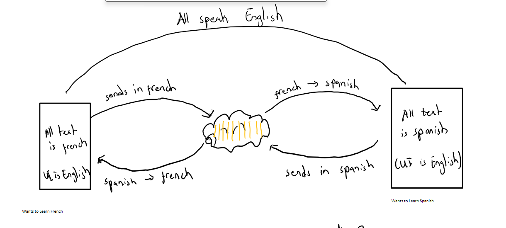

# Faulty-Hermes-Demo-1
A one day sprint to create a working version of our MVP to create a proof of concept. That is users will message each other in a language they don't understand but a trying to learn with a real time translation architecture that makes it possible for two users to interact even if they are learning different languages.

# Architecture

# How to setup project (In terminal)
* Step 1: Create venv (python -m venv venv)
* Step 2: Activate environment (venv/Scripts/activate)
* Step 3: pip install -r requirements.txt
* Step 4: Open Powershell as administrator
* Step 5: run wsl --install (Restart your computer when prompted.)
* Step 6: Open the new Ubuntu terminal and install Redis with these commands:
 - sudo apt update
 - sudo apt install redis-server
 - sudo service redis-server start
* Step 7: Run django backend (python manage.py runserver) 
